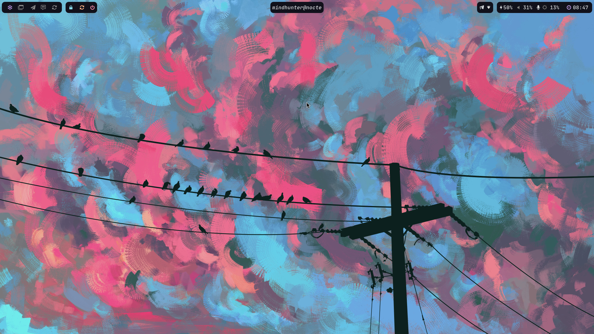
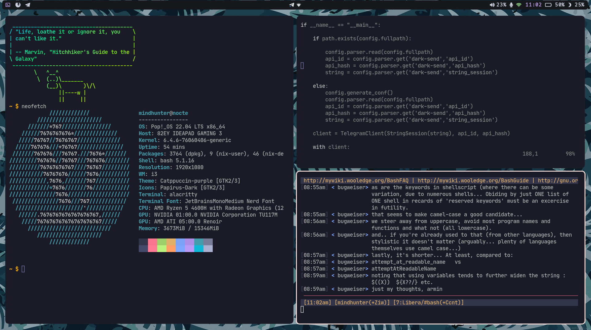

# mindhuntr's dotfiles 

This is a collection of configs for the various programs I have used in the course of learning linux 

## Screenshots 

## Programs 

| Feature              | Package                                                        | 
| -------------------- | -------------------------------------------------------------  |
| Window Manager       | [`i3-gaps-rounded`](https://github.com/jbenden/i3-gaps-rounded)|
| Compositor           | [`pijulius/picom`](https://github.com/pijulius/picom)          |
| Terminal             | [`alacritty`](https://github.com/alacritty/alacritty)          |
| Editor               | [`neovim`](https://github.com/neovim/neovim)                   |
| System Tray          | [`polybar`](https://github.com/vim/vim)                        |
| Application Launcher | [`rofi`](https://github.com/davatorium/rofi)                   |
| Multiplexer          | [`tmux`](https://github.com/tmux/tmux)                         |
| PDF Viewer           | [`zathura`](https://git.pwmt.org/pwmt/zathura.git)             |

