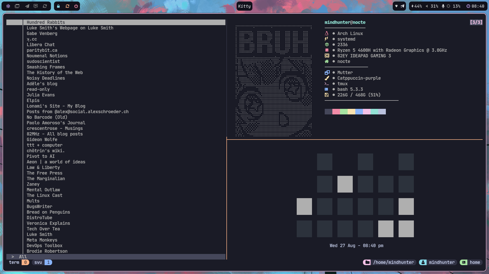

# mindhuntr's dotfiles 

This is a collection of configs for the various programs I have used in the course of learning linux 

## Screenshots 

## Programs 

| Feature              | Package                                                        | 
| -------------------- | -------------------------------------------------------------  |
| Window Manager       | [`hyprland`](https://hypr.land/)                               |
| Terminal             | [`kitty`](https://github.com/kovidgoyal/kitty)                 |
| Editor               | [`neovim`](https://github.com/neovim/neovim)                   |
| System Tray          | [`waybar`](https://github.com/Alexays/Waybar)                  |
| Application Launcher | [`rofi`](https://github.com/davatorium/rofi)                   |
| Multiplexer          | [`tmux`](https://github.com/tmux/tmux)                         |
| PDF Viewer           | [`sioyek`](https://sioyek.info/)                               |
| Feed Reader          | [`newsraft`](https://codeberg.org/newsraft/newsraft)           |

